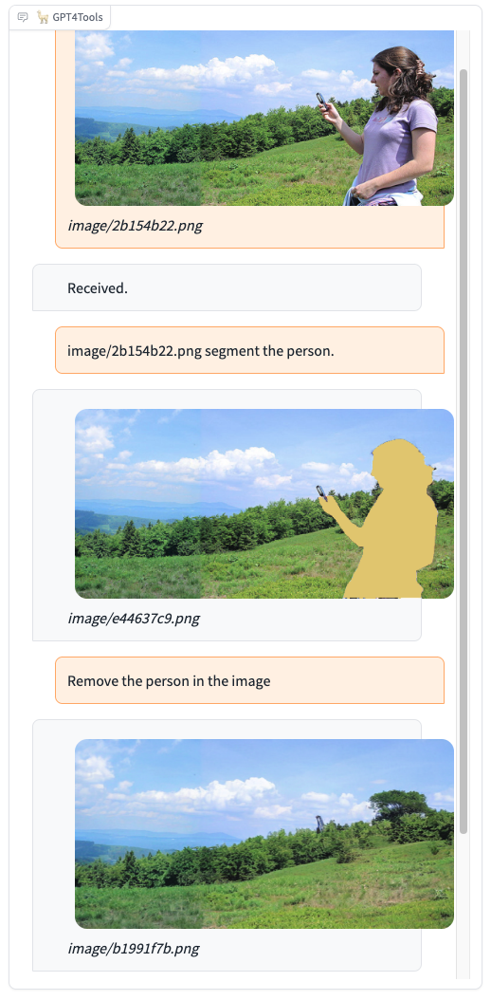
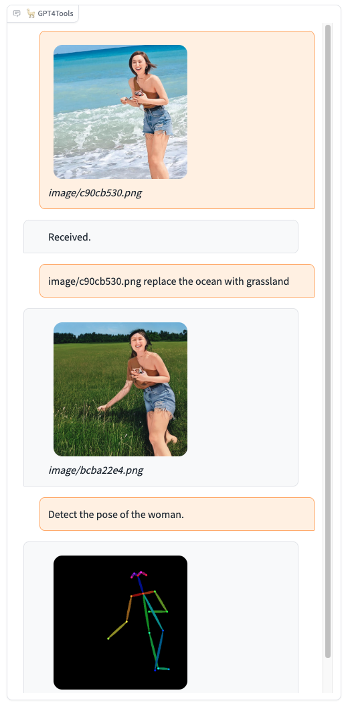
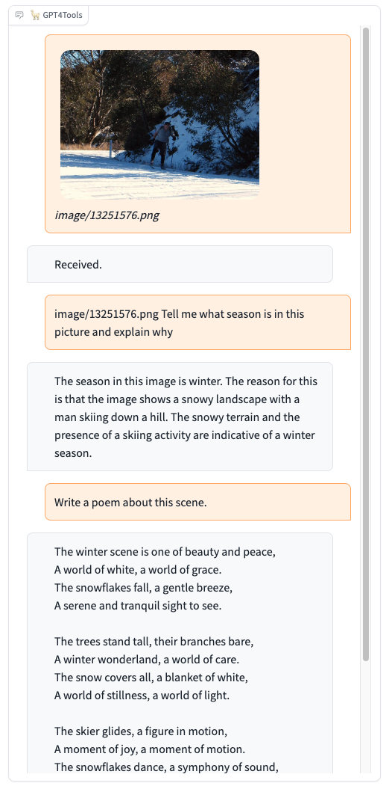
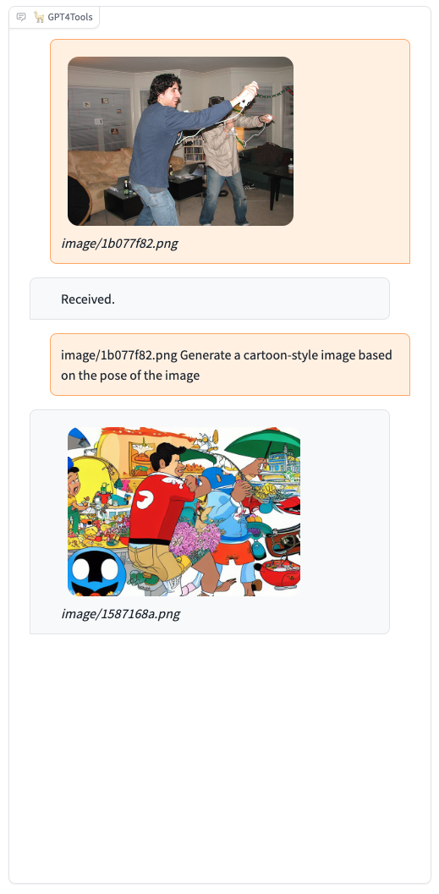

# GPT4Tools: Teaching LLM to Use Tools via Self-instruction

[Lin Song](http://linsong.info/), [Yanwei Li](https://yanwei-li.com/), [Rui Yang](https://github.com/Yangr116), Sijie Zhao, [Yixiao Ge](https://geyixiao.com/), [Ying Shan](https://scholar.google.com/citations?user=4oXBp9UAAAAJ&hl=en)

GPT4Tools is a centralized system that can control multiple visual foundation models. 
It is based on Vicuna (LLaMA), and 71K self-built instruction data.
By analyzing the language content, GPT4Tools is capable of automatically deciding, controlling, and utilizing different visual foundation models, allowing the user to interact with images during a conversation.
With this approach, GPT4Tools provides a seamless and efficient solution to fulfill various image-related requirements in a conversation.
Different from previous work, we support users teach their own LLM to use tools with simple refinement via self-instruction and LoRA.

<a href='https://gpt4tools.github.io'></a>  <a href='https://huggingface.co/stevengrove/gpt4tools-vicuna-13b-lora'></a>  [](https://youtu.be/Qrj94ibQIT8) [](https://arxiv.org/pdf/2305.18752.pdf)

## Updates

* 🔥 We now release the <a href='https://arxiv.org/pdf/2305.18752.pdf'><strong><font color='#008AD7'>paper</font></strong></a> and new <a href='https://huggingface.co/spaces/stevengrove/GPT4Tools'><strong><font color='#008AD7'>demo</font></strong></a> with LLAVA, OPT, LlaMA and Vicuna.
* 🔥 We released pretrained GPT4Tools models with <strong><font color="#008AD7">Vicuna-13B</font></strong> and released the dataset for <strong><font color="#008AD7">self-instruction</font></strong>. Check out the blog and demo.

## Demo
We provide some selected examples using GPT4Tools in this section. More examples can be found in our [project page](https://gpt4tools.github.io). Feel free to try our onlin [demo](https://c60eb7e9400930f31b.gradio.live)!


<div align=center>

</div>

  |   |   |
:-------------------------:|:-------------------------:
 |  
  |  

## Dataset
| **Data file name** | **Size** | OneDrive| Google Driver|
|:------------------:|:--------:| :--------: | :---------:|
| gpt4tools_71k.json    | 229 MB   | [link](https://1drv.ms/u/s!AqPQkBZ4aeVnhRdryHC9b1NtWJpZ?e=ZHBCqd) | [link](https://drive.google.com/file/d/1JKIT-Or1of7TJuWvmrJpPoOx0cLdcWry/view?usp=share_link)|

```gpt4tools_71k.json``` contains 71K instruction-following data we used for fine-tuning the GPT4Tools model. 

The data collection process is illustrated below:

We fed GPT-3.5 with captions from 3K images and descriptions of 22 visual tasks. This produced 66K instructions, each corresponding to a specific visual task and a visual foundation model (tool). Subsequently, we eliminated duplicate instructions and retained 41K sound instructions. To teach the model to utilize tools in a predefined manner, we followed the prompt format used in Visual ChatGPT and converted these instructions into a conversational format. Concurrently, we generated negative data without tool usage by randomly sampling 3K instructions from [`alpaca_gpt4_data`](https://github.com/Instruction-Tuning-with-GPT-4/GPT-4-LLM/blob/main/data/alpaca_gpt4_data.json) and converting them to the defined format. Using the generated 71K instructions, we finetuned the Vicuna using LoRA and got our GPT4Tools, which can automatically decide, control, and utilize distinct tools in a conversation.


## Models
GTP4Tools mainly contains three parts: LLM for instruction, LoRA for adaptation, and Visual Agent for provided functions.
It is a flexible and extensible system that can be easily extended to support more tools and functions.
For example, users can replace the existing LLM or tools with their own models, or add new tools to the system.
The only things needed are finetuned the LoRA with the provided instruction, which teaches LLM to use the provided tools.


### Preparation


```
git clone https://github.com/stevengrove/GPT4Tools
cd GPT4Tools
pip install -r requirements.txt
```
* If bitsandbytes doesn't work, [install it from source.](https://github.com/TimDettmers/bitsandbytes/blob/main/compile_from_source.md) Windows users can follow [these instructions](https://github.com/tloen/alpaca-lora/issues/17).


### Weights
GPT4Tools is based on the Vicuna, we release the LoRA weights of GPT4Tools to comply with the LLaMA model license. You can merge our LoRA weights with the Vicuna weights to obtain the GPT4Tools weights.

Steps:
1. Get the original LLaMA weights in the Hugging Face format from [here](https://huggingface.co/docs/transformers/main/model_doc/llama).
2. Using the [FastChat](https://github.com/lm-sys/FastChat/blob/main/README.md) to get Vicuna weigths by applying [the delta weights](https://huggingface.co/lmsys), more details please check [here](https://github.com/lm-sys/FastChat#vicuna-weights).
3. Get the LoRA weights of GPT4Tools ([Hugging Face](https://huggingface.co/stevengrove/gpt4tools-vicuna-13b-lora), [OneDrive](https://1drv.ms/f/s!AqPQkBZ4aeVnhRzM69NOXLyG8cTY?e=apmpyQ), or [Google Driver](https://drive.google.com/drive/folders/1ebUINGR0QzNL-4hoKl19-6D_5rfeWTPD?usp=share_link)).

### Tools
GPT4Tools can support 22 tools, more details please check [tools.md](docs/tools.md).
When using tools for the first time, the weights of tools need to be downloaded. If you don't like stored them on default cache, please revise the shell environment varibles: 
```
export TRANSFORMERS_CACHE=${your_transformers_cache}
export HUGGINGFACE_HUB_CACHE=${your_diffusers_cache}
```
For SAM (Segmenting tools) and GrundingDINO (Text2Box tools):
```
export checkpoints=${your_checkpoints_cache} 
# or
ln -s ${your_checkpoints_path} checkpoints
```

### Serving with Web GUI 
Making a gradio interface on your own devices:
```
# Advice for 1 GPU
python gpt4tools.py \
	--base_model <path_to_vicuna_with_tokenizer> \
	--lora_model <path_to_lora_weights> \
	--llm_device "cpu" \
	--load "Text2Box_cuda:0,Segmenting_cuda:0,Inpainting_cuda:0,ImageCaptioning_cuda:0"
```

```
# Advice for 4 GPUs
python gpt4tools.py \
	--base_model <path_to_vicuna_with_tokenizer> \
	--lora_model <path_to_lora_weights> \
	--llm_device "cuda:3" \
	--load "Text2Box_cuda:0,Segmenting_cuda:0,Inpainting_cuda:0,ImageCaptioning_cuda:0,
		   Text2Image_cuda:1,VisualQuestionAnswering_cuda:1,InstructPix2Pix_cuda:2,
		   SegText2Image_cuda:2,Image2Pose_cpu,PoseText2Image_cuda:2"
```
You can customize the used tools by specifying ```{tools_name}_{devices}``` after args ```--load``` of ```gpt4tools.py```. ```tools_name``` is illustrated in [tools.md](./docs/tools.md).

### Finetuning with LoRA

```
# Training with 8 GPUs
torchrun --nproc_per_node=8 --master_port=29005 lora_finetune.py \
	--base_model <path_to_vicuna_with_tokenizer> \
	--data_path <path_to_gpt4tools_71k.json> \
	--output_dir output/gpt4tools \
	--prompt_template_name gpt4tools \
	--num_epochs 6 \
	--batch_size 512 \
	--cutoff_len 2048 \
	--group_by_length \
	--lora_target_modules '[q_proj,k_proj,v_proj,o_proj]' \
	--lora_r 16 \
	--micro_batch_size=8
```

| Hyperparameter | Global Batch Size | Learning rate | Max length | Weight decay | LoRA attention dimension (lora_r) | LoRA scaling alpha(lora_alpha) | LoRA dropout (lora_dropout) | Modules to apply LoRA (lora_target_modules)      |
|:--------------:|:-----------------:|:-------------:|:----------:|:------------:|:---------------------------------:|:----------:|:------------:|:-----------------------------:|
|    GPT4Tools & Vicuna-13B   |        512        |      3e-4     |    2048    |      0.0     |                 16                |     16     |     0.05     | [q_proj,k_proj,v_proj,o_proj] |


## Acknowledgement
* [VisualChatGPT](https://github.com/microsoft/TaskMatrix): It connects ChatGPT and a series of Visual Foundation Models to enable sending and receiving images during chatting.
* [Vicuna](https://github.com/lm-sys/FastChat): The language ability of Vicuna is fantastic and amazing. And it is open-source!
* [Alpaca-LoRA](https://github.com/tloen/alpaca-lora): Instruct-tune LLaMA on consumer hardware.

If you're using our GPT4Tools in your research or applications, please cite using this BibTeX:
```
@misc{gpt4tools,
  title = {GPT4Tools: Teaching LLM to Use Tools via Self-instruction},
  author = {Lin Song and Yanwei Li and Rui Yang and Sijie Zhao and Yixiao Ge and Ying Shan},
  year = {2023},
}
```
