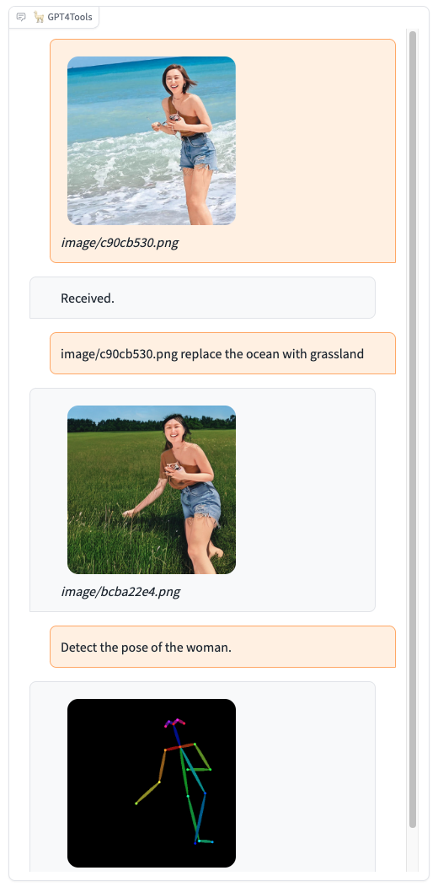
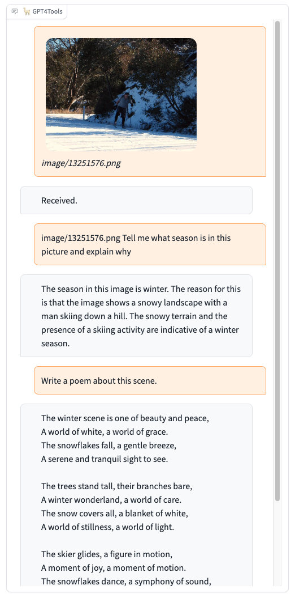
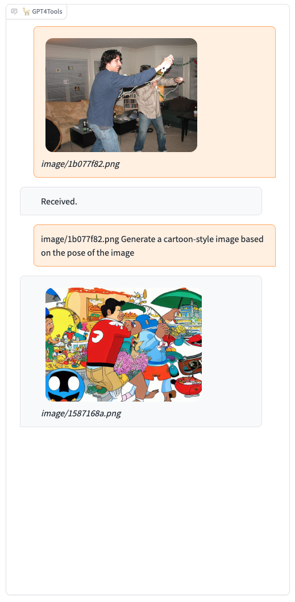
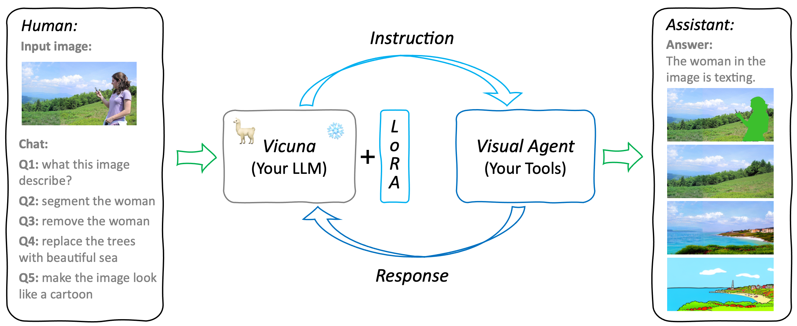

# GPT4Tools: Teaching LLM to Use Tools via Self-instruction

[Lin Song](http://linsong.info/), [Yanwei Li](https://yanwei-li.com/), [Rui Yang](https://github.com/Yangr116), Sijie Zhao, [Yixiao Ge](https://geyixiao.com/), [Xiu Li](https://www.sigs.tsinghua.edu.cn/lx/), [Ying Shan](https://scholar.google.com/citations?user=4oXBp9UAAAAJ&hl=en)


GPT4Tools is a centralized system that can control multiple visual foundation models. 
It is based on Vicuna (LLaMA), and 71K self-built instruction data.
By analyzing the language content, GPT4Tools is capable of automatically deciding, controlling, and utilizing different visual foundation models, allowing the user to interact with images during a conversation.
With this approach, GPT4Tools provides a seamless and efficient solution to fulfill various image-related requirements in a conversation.
Different from previous work, we support users teach their own LLM to use tools with simple refinement via self-instruction and LoRA.

<a href='https://gpt4tools.github.io'></a>  <a href='https://huggingface.co/stevengrove/gpt4tools-vicuna-13b-lora'></a>  [](https://youtu.be/Qrj94ibQIT8) [](https://arxiv.org/pdf/2305.18752.pdf)

## Updates

* 🔥 We update new code and models adapted to vicuna-v1.5!
* 🔥 Our paper is accpeted by [NIPS 2023](https://openreview.net/pdf?id=cwjh8lqmOL)!
* 🔥 We now release the <a href='https://arxiv.org/pdf/2305.18752.pdf'><strong><font color='#008AD7'>paper</font></strong></a> and new <a href='https://huggingface.co/spaces/stevengrove/GPT4Tools'><strong><font color='#008AD7'>demo</font></strong></a> with LLAVA, OPT, LlaMA and Vicuna.
* 🔥 We released pretrained GPT4Tools models with <strong><font color="#008AD7">Vicuna-13B</font></strong> and released the dataset for <strong><font color="#008AD7">self-instruction</font></strong>. Check out the blog and demo.

## Demo
We provide some selected examples using GPT4Tools in this section. More examples can be found in our [project page](https://gpt4tools.github.io). Feel free to try our onlin [demo](https://c60eb7e9400930f31b.gradio.live)!


<div align=center>

</div>

<details>
  <summary>More demos</summary>

|   |   |
:-------------------------:|:-------------------------:
 |  
  |  

</details>


---
## Dataset
| Data file name | **Size** | OneDrive| Google Driver|
|:------------------|:--------:| :--------: | :---------:|
| gpt4tools_71k.json    | 229 MB   | [link](https://1drv.ms/u/s!AqPQkBZ4aeVnhRdryHC9b1NtWJpZ?e=ZHBCqd) | [link](https://drive.google.com/file/d/1JKIT-Or1of7TJuWvmrJpPoOx0cLdcWry/view?usp=share_link)|
| gpt4tools_val_seen.json    | --   | [link](https://1drv.ms/u/s!AqPQkBZ4aeVnhT1DPh5qZtSoZjtC?e=bDALfB) | [link](https://drive.google.com/file/d/1nDl7zhtQSx-L12K7151DfQD-XTqh_uzc/view?usp=sharing)|
| gpt4tools_test_unseen.json    | --   | [link](https://1drv.ms/u/s!AqPQkBZ4aeVnhTz3dCV77Ps6abzQ?e=ex4ojQ) | [link](https://drive.google.com/file/d/1BHm0HEwYaVdMRYZiDdECy8ozyix607PH/view?usp=sharing)|

* ```gpt4tools_71k.json``` contains 71K instruction-following data we used for fine-tuning the GPT4Tools model. 

* ```gpt4tools_val_seen.json``` is the manually cleaned instruction data used for validation, which includes instructions related to tools of ```gpt4tools_71k.json```.

* ```gpt4tools_test_unseen.json``` cleaned instruction data used for testing, including instructions related to some tools that are absented in ```gpt4tools_71k.json```.

[data.md](./asserts/docs/data.md) shows how to generate, format and clean the data.


## Models
GTP4Tools mainly contains three parts: LLM for instruction, LoRA for adaptation, and Visual Agent for provided functions.
It is a flexible and extensible system that can be easily extended to support more tools and functions.
For example, users can replace the existing LLM or tools with their own models, or add new tools to the system.
The only things needed are finetuned the LoRA with the provided instruction, which teaches LLM to use the provided tools.



GPT4Tools is based on the [Vicuna](https://github.com/lm-sys/FastChat), we release the LoRA weights of GPT4Tools to comply with the LLaMA model license. You can merge our LoRA weights with the Vicuna weights to obtain the GPT4Tools weights.


## Getting Start
### Env
```
git clone https://github.com/AILab-CVC/GPT4Tools
cd GPT4Tools
pip install -r requirements.txt
```

### Weights 
1. Download [vicuna-7b-v1.5](https://huggingface.co/lmsys/vicuna-7b-v1.5) and [vicuna-13b-v1.5](https://huggingface.co/lmsys/vicuna-13b-v1.5).
```
# download to your cache dir
python3 scripts/download.py \
	--model-names "lmsys/vicuna-13b-v1.5" "lmsys/vicuna-7b-v1.5" \
	--cache-dir $your_cache_dir
```

2. Download gpt4tools LoRA weights following the below links:

| Models | OneDrive| Google Driver| Huggingface|
|:------------------|:--------: | :---------:| :---------:|
| vicuna-7b-v1.5-gpt4tools    | [link]() | [link](https://drive.google.com/file/d/1UdA6_iOxXZs2V13adLa_V605Ty19KR4s/view?usp=sharing) | | 
| vicuna-13b-v1.5-gpt4tools    | [link]() | [link](https://drive.google.com/file/d/1V6r2aoo1ovxMi63yPkUC0fwdz-M-xXwC/view?usp=sharing)| |

Old weights can be found [here](./asserts/docs/weights.md).

### Tools
GPT4Tools supports 22 tools. Please check [tools.md](docs/tools.md) for more details.
When using tools for the first time, the weights of tools need to be downloaded to cache. If you don't like stored them on default cache, please revise the shell environment varibles: 
```
export TRANSFORMERS_CACHE=${your_transformers_cache}
export HUGGINGFACE_HUB_CACHE=${your_diffusers_cache}
```
Additionally, you can also download weights to the custom cache.
```
# download huggingface model
python3 scripts/download.py \
	--model-names "Salesforce/blip-image-captioning-base" "Salesforce/blip-vqa-base" "timbrooks/instruct-pix2pix" "runwayml/stable-diffusion-v1-5" "runwayml/stable-diffusion-inpainting" "lllyasviel/ControlNet" "fusing/stable-diffusion-v1-5-controlnet-canny" "fusing/stable-diffusion-v1-5-controlnet-mlsd" "fusing/stable-diffusion-v1-5-controlnet-hed" "fusing/stable-diffusion-v1-5-controlnet-scribble" "fusing/stable-diffusion-v1-5-controlnet-openpose" "fusing/stable-diffusion-v1-5-controlnet-seg" "fusing/stable-diffusion-v1-5-controlnet-depth" "fusing/stable-diffusion-v1-5-controlnet-normal" "sam" "groundingdino" \
	--cache-dir $your_cache_dir
```

### Serving with Web GUI 
Following [scripts/demo.sh](./scripts/demo.sh) or the below code to make a gradio interface on your own devices:
```
# Advice for 1 GPU
python gpt4tools_demo.py \
	--base_model $path_to_vicuna_with_tokenizer \
	--lora_model $path_to_lora_weights \
	--llm_device "cpu" \ 
	--load "Text2Box_cuda:0,Segmenting_cuda:0,Inpainting_cuda:0,ImageCaptioning_cuda:0" \ 
	--cache-dir $your_cache_dir \
	--server-port 29509 \
	--share
```

```
# Advice for 4 GPUs
python gpt4tools_demo.py \
	--base_model $path_to_vicuna_with_tokenizer
	--lora_model $path_to_lora_weights \
	--llm_device "cuda:3" \
	--load "Text2Box_cuda:0,Segmenting_cuda:0,Inpainting_cuda:0,ImageCaptioning_cuda:0,Text2Image_cuda:1,VisualQuestionAnswering_cuda:1,InstructPix2Pix_cuda:2,SegText2Image_cuda:2,Image2Pose_cpu,PoseText2Image_cuda:2" \
	--cache-dir $your_cache_dir \
	--server-port 29509 \
	--share
```

You can customize the used tools by specifying ```{tools_name}_{devices}``` after args ```--load``` of ```gpt4tools_demo.py```. ```tools_name``` is illustrated in [tools.md](./docs/tools.md).

### Finetuning
After downloading the ```gpt4tools_71k.json``` to ```./datasets```, you can follow [scripts/finetune_lora.sh](scripts/finetune_lora.sh) or run the below code to finetune your model:
```
deepspeed train.py \
	--base_model $path_to_vicuna_with_tokenizer \
	--data_path $path_to_gpt4tools_71k.json \
	--deepspeed "scripts/zero2.json" \
	--output_dir output/gpt4tools \
	--num_epochs 6 \
	--per_device_train_batch_size 1 \
	--per_device_eval_batch_size 4 \
	--gradient_accumulation_steps 16 \
	--model_max_length 2048 \
	--lora_target_modules '[q_proj,k_proj,v_proj,o_proj]' \
	--lora_r 16 \
	--learning_rate 3e-4 \
	--lazy_preprocess True \
	--cache_dir $your_cache_dir \
	--report_to 'tensorboard' \
	--gradient_checkpointing True
```

| Hyperparameter | Global Batch Size | Learning rate | Max length | Weight decay | LoRA attention dimension (lora_r) | LoRA scaling alpha(lora_alpha) | LoRA dropout (lora_dropout) | Modules to apply LoRA (lora_target_modules)      |
|:--------------:|:-----------------:|:-------------:|:----------:|:------------:|:---------------------------------:|:----------:|:------------:|:-----------------------------:|
|    GPT4Tools & Vicuna-13B   |        512        |      3e-4     |    2048    |      0.0     |                 16                |     16     |     0.05     | [q_proj,k_proj,v_proj,o_proj] |

If you want to evaluate the model's successful rate of using tools, please locate [here](./asserts/docs/inference.md).

## Acknowledgement
* [VisualChatGPT](https://github.com/microsoft/TaskMatrix): It connects ChatGPT and a series of Visual Foundation Models to enable sending and receiving images during chatting.
* [Vicuna](https://github.com/lm-sys/FastChat): The language ability of Vicuna is fantastic and amazing. And it is open-source!
* [Alpaca-LoRA](https://github.com/tloen/alpaca-lora): Instruct-tune LLaMA on consumer hardware.

If you're using our GPT4Tools in your research or applications, please cite:
```
@misc{gpt4tools,
  title = {GPT4Tools: Teaching LLM to Use Tools via Self-instruction},
  author={Rui Yang, Lin Song, Yanwei Li, Sijie Zhao, Yixiao Ge, Xiu Li, Ying Shan},
  journal={arXiv preprint arXiv:2305.18752},
  year={2023}
}
```
